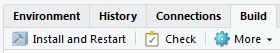

<!-- README.md is generated from README.Rmd. Please edit that file -->

```{r, echo = FALSE}
knitr::opts_chunk$set(
  comment = "#>",
  fig.path = "man/figures/README-"
)
```

## urbnthemes

### Overview

`urbnthemes` is a set of tools for creating Urban Institute-themed plots and maps in R. The package extends `ggplot2` by Hadley Wickham with web, print, and map themes as well as tools that make plotting easier at the Urban Institute. `urbnthemes` replaces the [urban_R_theme](https://github.com/UrbanInstitute/urban_R_theme).

### Installation

The only way to install the package is to download this entire directory, open the RStudio project, and click "Install and Restart". Then use `library(urbnthemes)` to load the package.



When this reposiotry is made public, the following will work:

```
# Or the development version from GitHub
# install.packages("devtools")
devtools::install_github("UI-Research/urbnthemes")
```

### Usage


```{r example}
library(ggplot2)
library(urbnthemes)

set_urban_defaults()

ggplot(mtcars, aes(wt, mpg)) +
  geom_point()
```

```{r example2}
library(ggplot2)
library(urbnthemes)
library(grid)
library(gridExtra)

set_urban_defaults()

plot <- ggplot(mtcars, aes(wt, mpg)) +
  geom_point()

grid.arrange(plot, urban_logo_text(), ncol = 1, heights = c(30, 1))

```

Core themes:

* `set_urban_defaults()`
* `theme_urban_web()`
* `theme_urban_print()`

Color scales:

* `scale_color_urban()`
* `scale_fill_urban()`
* `scale_gradientn()`

Formatting functions:

* `urban_logo_text()`

Utility functions:

* `lato_test()`
* `lato_install()`

In development:

* `urban_logo_image()`
* `undo_urban_defaults()`
* `theme_urban_map()`
* `save_urban_print()`
* `save_urban_web()`
* `urban_rmarkdown_header()`

### Getting help

Contact [Aaron Williams](awilliams@urban.org) or [Kyle Ueyama](kueyama@urban.org) with feedback or questions. 
