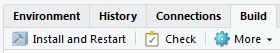

## uithemes

### Overview

`uithemes` is a set of tools for creating Urban Institute themed plots and maps in R. The package extends `ggplot2` by Hadley Wickham with web, print, and map themes as well as tools that make plotting easier at the Urban Institute. `uithemes` replaces the [urban_R_theme](https://github.com/UrbanInstitute/urban_R_theme).

### Installation

The only way to install the package is to download this entire directory, open the RStudio project, and click "Install and Restart". Then use `library(uithemes)` to load the package.



When this reposiotry is made public, the following will work:

```
# Or the development version from GitHub
# install.packages("devtools")
devtools::install_github("hadley/tidyverse")
```

### Usage

* them_urban_web()
* theme_urban_print()
* set_urban_defaults()
* scale_color_urban()
* scale_fill_urban()
* scale_gradientn()

### In development

* urban_logo_text()
* urban_logo_image()
* install_lato()
* test_lato()
* undo_urban_defaults()
* theme_urban_map()
* save_urban_print()
* save_urban_web()


