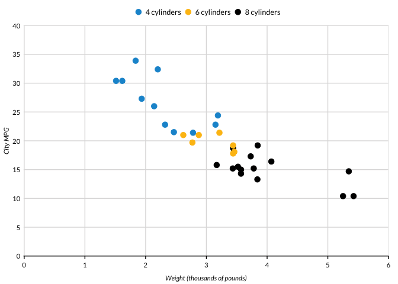
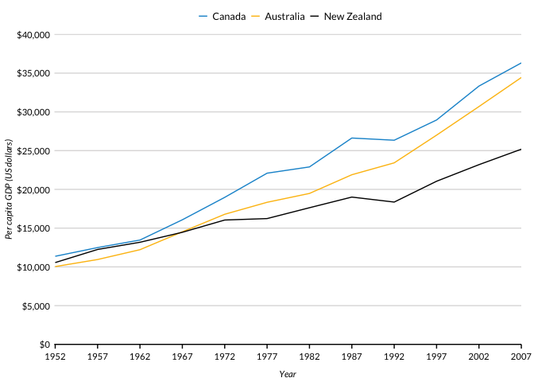

<!-- README.md is generated from README.Rmd. Please edit that file -->

# urbnthemes <a href="https://UrbanInstitute.github.io/urbnthemes/"></a>

[](https://travis-ci.org/UrbanInstitute/urbnthemes)

## Overview

`urbnthemes` is a set of tools for creating Urban Institute-themed plots
and maps in R. The package extends `ggplot2` with print and map themes
as well as tools that make plotting easier at the Urban Institute.

A comprehensive set of examples is available at the [Urban Institute R
Users Group
website](https://UrbanInstitute.github.io/r-at-urban/graphics-guide.html).

## Stay up-to-date

Sign up
[here](https://app.smartsheet.com/b/form/9029a0a8254e4044a52cdebaebe343bf)
to stay up-to-date with R package releases and R resources from the
Urban Institute. We will not share your information and we will not
email more than once per month.

## Installation

    install.packages("devtools")
    devtools::install_github("UrbanInstitute/urbnthemes", build_vignettes = TRUE)

## Fonts

The Urban Institute uses [Lato](https://fonts.google.com/specimen/Lato)
font for publications. After installing `urbnthemes`, submit
`urbnthemes::lato_test()` to see if Lato is imported and registered.

If Lato isn’t imported and registered, install
[Lato](https://fonts.google.com/specimen/Lato) and then submit
`urbnthemes::lato_install()`. If you are on a Windows, you may need to
install [ghostscript](https://www.ghostscript.com/download.html) and
then submit `Sys.setenv(R_GSCMD = "link to the ghostscript .exe")`
before running `urbnthemes::lato_install()`.

Waffle charts with glyphs require fontawesome. `fontawesome_test()` and
`fontawesome_install()` are the fontawesome versions of the above
functions. Be sure to install fontawesome from
[here](https://github.com/hrbrmstr/waffle/tree/master/inst/fonts).

## Usage

Always load `library(urbnthemes)` after `library(ggplot2)` or
`library(tidyverse)`.

``` r
library(tidyverse)
library(urbnthemes)

set_urbn_defaults(style = "print")
```

    #> Warning: New theme missing the following elements: axis.ticks.length.x,
    #> axis.ticks.length.x.top, axis.ticks.length.x.bottom, axis.ticks.length.y,
    #> axis.ticks.length.y.left, axis.ticks.length.y.right

``` r
ggplot(data = mtcars, mapping = aes(factor(cyl))) +
  geom_bar() + 
  scale_y_continuous(expand = expand_scale(mult = c(0, 0.1))) +
  labs(x = "Number of Cylinders",
       y = "Count") +
  remove_ticks()
```

<!-- -->

``` r
ggplot(data = mtcars, mapping = aes(x = wt, y = mpg)) +
  geom_point() +
  scale_x_continuous(expand = expand_scale(mult = c(0.002, 0)), 
                     limits = c(0, 6),
                     breaks = 0:6) +
  scale_y_continuous(expand = expand_scale(mult = c(0, 0.002)), 
                     limits = c(0, 40),
                     breaks = 0:8 * 5) +
  labs(x = "Weight (thousands of pounds)",
       y = "City MPG") +
  scatter_grid()
```

<!-- -->

``` r
mtcars %>%
  mutate(cyl = paste(cyl, "cylinders")) %>%
  ggplot(aes(x = wt, y = mpg, color = cyl)) +
  geom_point() +
  scale_x_continuous(expand = expand_scale(mult = c(0.002, 0)), 
                     limits = c(0, 6),
                     breaks = 0:6) +
  scale_y_continuous(expand = expand_scale(mult = c(0, 0.002)), 
                     limits = c(0, 40),
                     breaks = 0:8 * 5) +
  labs(x = "Weight (thousands of pounds)",
       y = "City MPG") +
  scatter_grid()
```

<!-- -->

``` r
library(gapminder)

gapminder %>%
  filter(country %in% c("Australia", "Canada", "New Zealand")) %>%
  mutate(country = factor(country, levels = c("Canada", "Australia", "New Zealand"))) %>%
  ggplot(aes(year, gdpPercap, color = country)) +
  geom_line() +
  scale_x_continuous(expand = expand_scale(mult = c(0.002, 0)), 
                     breaks = c(1952 + 0:12 * 5), 
                     limits = c(1952, 2007)) +
  scale_y_continuous(expand = expand_scale(mult = c(0, 0.002)), 
                     breaks = 0:8 * 5000,
                     labels = scales::dollar, 
                     limits = c(0, 40000)) +
  labs(x = "Year",
       y = "Per capita GDP (US dollars)")
```

<!-- -->

``` r
txhousing %>%
  filter(city %in% c("Austin","Houston","Dallas","San Antonio","Fort Worth")) %>%
  group_by(city, year) %>%
  summarize(sales = sum(sales)) %>%
  ggplot(aes(x = year, y = sales, fill = city)) +
  geom_area(position = "stack") +
  scale_x_continuous(expand = expand_scale(mult = c(0, 0)),
                     limits = c(2000, 2015),
                     breaks = 2000 + 0:15) +  
  scale_y_continuous(expand = expand_scale(mult = c(0, 0.2)), 
                     labels = scales::comma) +
  labs(x = "Year",
       y = "Home sales")
```

<!-- -->

## Branding

``` r
library(ggplot2)
library(urbnthemes)
library(grid)
library(gridExtra)
```

    #> 
    #> Attaching package: 'gridExtra'

    #> The following object is masked from 'package:dplyr':
    #> 
    #>     combine

``` r
set_urbn_defaults()
```

    #> Warning: New theme missing the following elements: axis.ticks.length.x,
    #> axis.ticks.length.x.top, axis.ticks.length.x.bottom, axis.ticks.length.y,
    #> axis.ticks.length.y.left, axis.ticks.length.y.right

``` r
plot <- ggplot(data = mtcars, mapping = aes(factor(cyl))) +
  geom_bar() + 
  scale_y_continuous(expand = expand_scale(mult = c(0, 0.1))) +
  labs(x = "Number of Cylinders",
       y = "Count") +
  remove_ticks()

grid.arrange(plot, urbn_logo_text(), ncol = 1, heights = c(30, 1))
```

<!-- -->

Core themes:

  - `set_urbn_defaults()`
  - `theme_urbn_print()`
  - `theme_urbn_map()`

Formatting functions:

  - `urbn_logo_text()`
  - `remove_ticks()`
  - `remove_axis()`
  - `scatter_grid()`
  - `add_axis()`
  - `urbn_geofacet`

Utility functions:

  - `lato_test()`
  - `lato_install()`
  - `fontawesome_test()`
  - `fontawesome_install()`
  - `view_palette()`

In development:

  - `undo_urbn_defaults()`
  - `save_urbn_print()`

## Getting help

Contact [Aaron Williams](awilliams@urban.org) or [Kyle
Ueyama](kueyama@urban.org) with feedback or questions.

## Code of conduct

Please note that this project is released with a [Contributor Code of
Conduct](CODE_OF_CONDUCT.md). By participating in this project you agree
to abide by its terms.
