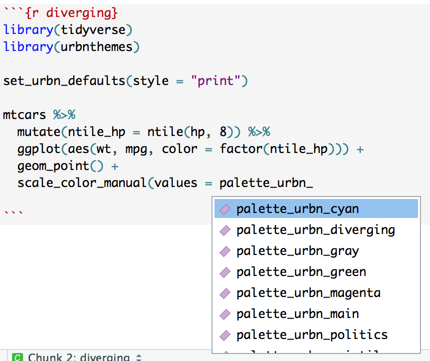

## Overview

`urbnthemes` is a set of tools for creating Urban Institute-themed plots and maps in R. The package extends `ggplot2` with print and map themes as well as tools that make plotting easier at the Urban Institute. `urbnthemes` replaces the [urban_R_theme](https://github.com/UrbanInstitute/urban_R_theme).

A comprehensive set of examples is available at the [Urban Institute R Users Group website](https://ui-research.github.io/r-at-urban/graphics-guide.html). 

## Fonts

The Urban Institute uses [Lato](https://fonts.google.com/specimen/Lato) font for publications. After installing `urbnthemes`, submit `urbnthemes::lato_test()` to see if Lato is imported and registered. 

If Lato isn't imported and registered, install [Lato](https://fonts.google.com/specimen/Lato) and then submit `urbnthemes::lato_install()`. If you are on a Windows, you may need to install [ghostscript](https://www.ghostscript.com/download.html) and then submit `Sys.setenv(R_GSCMD = "link to the ghostscript .exe")` before running `urbnthemes::lato_install()`.

Waffle charts with glyphs require fontawesome. `fontawesome_test()` and `fontawesome_install()` are the fontawesome versions of the above functions. Be sure to install fontawesome from [here](https://github.com/hrbrmstr/waffle/tree/master/inst/fonts).

## Usage

Always load `library(urbnthemes)` after `library(ggplot2)` or `library(tidyverse)`.

```{r example, message=FALSE}
library(tidyverse)
library(urbnthemes)

set_urbn_defaults(style = "print")

ggplot(data = mtcars, mapping = aes(factor(cyl))) +
  geom_bar() + 
  scale_y_continuous(expand = expand_scale(mult = c(0, 0.1))) +
  labs(x = "Number of Cylinders",
       y = "Count") +
  remove_ticks()
```

```{r scatter-plot-1}
ggplot(data = mtcars, mapping = aes(x = wt, y = mpg)) +
  geom_point() +
  scale_x_continuous(expand = expand_scale(mult = c(0.002, 0)), 
                     limits = c(0, 6),
                     breaks = 0:6) +
  scale_y_continuous(expand = expand_scale(mult = c(0, 0.002)), 
                     limits = c(0, 40),
                     breaks = 0:8 * 5) +
  labs(x = "Weight (thousands of pounds)",
       y = "City MPG") +
  scatter_grid()
```

```{r scatter-plot-2}
mtcars %>%
  mutate(cyl = paste(cyl, "cylinders")) %>%
  ggplot(aes(x = wt, y = mpg, color = cyl)) +
  geom_point() +
  scale_x_continuous(expand = expand_scale(mult = c(0.002, 0)), 
                     limits = c(0, 6),
                     breaks = 0:6) +
  scale_y_continuous(expand = expand_scale(mult = c(0, 0.002)), 
                     limits = c(0, 40),
                     breaks = 0:8 * 5) +
  labs(x = "Weight (thousands of pounds)",
       y = "City MPG") +
  scatter_grid()
```

```{r line-plot}
library(gapminder)

gapminder %>%
  filter(country %in% c("Australia", "Canada", "New Zealand")) %>%
  mutate(country = factor(country, levels = c("Canada", "Australia", "New Zealand"))) %>%
  ggplot(aes(year, gdpPercap, color = country)) +
  geom_line() +
  scale_x_continuous(expand = expand_scale(mult = c(0.002, 0)), 
                     breaks = c(1952 + 0:12 * 5), 
                     limits = c(1952, 2007)) +
  scale_y_continuous(expand = expand_scale(mult = c(0, 0.002)), 
                     breaks = 0:8 * 5000,
                     labels = scales::dollar, 
                     limits = c(0, 40000)) +
  labs(x = "Year",
       y = "Per capita GDP (US dollars)")
```

```{r area-plot}

txhousing %>%
  filter(city %in% c("Austin","Houston","Dallas","San Antonio","Fort Worth")) %>%
  group_by(city, year) %>%
  summarize(sales = sum(sales)) %>%
  ggplot(aes(x = year, y = sales, fill = city)) +
  geom_area(position = "stack") +
  scale_x_continuous(expand = expand_scale(mult = c(0, 0)),
                     limits = c(2000, 2015),
                     breaks = 2000 + 0:15) +  
  scale_y_continuous(expand = expand_scale(mult = c(0, 0.2)), 
                     labels = scales::comma) +
  labs(x = "Year",
       y = "Home sales")
```

## Branding

```{r example2}
library(ggplot2)
library(urbnthemes)
library(grid)
library(gridExtra)

set_urbn_defaults()

plot <- ggplot(data = mtcars, mapping = aes(factor(cyl))) +
  geom_bar() + 
  scale_y_continuous(expand = expand_scale(mult = c(0, 0.1))) +
  labs(x = "Number of Cylinders",
       y = "Count") +
  remove_ticks()

grid.arrange(plot, urbn_logo_text(), ncol = 1, heights = c(30, 1))

```

Core themes:

* `set_urbn_defaults()`
* `theme_urbn_print()`
* `theme_urbn_map()`

Formatting functions:

* `urbn_logo_text()`
* `remove_ticks()`
* `remove_axis()`
* `scatter_grid()`
* `add_axis()`
* `urbn_geofacet`

Utility functions:

* `lato_test()`
* `lato_install()`
* `fontawesome_test()`
* `fontawesome_install()`
* `view_palette()`

In development:

* `undo_urbn_defaults()`
* `save_urbn_print()`

## Quick palettes

`urbnthemes` contains many quick-access color palettes from the [Urban Institute Data Visualization Style Guide](http://urbaninstitute.github.io/graphics-styleguide/). These palettes can be used to quickly overwrite default color palettes from `urbnthemes`.

* `palette_urbn_main` is the eight color discrete palette of the Urban Institute with cyan, yellow, black, gray, magenta, green, space gray, and red. 
* `palette_urbn_diverging` is an eight color diverging palette. 
* `palette_urbn_quintile` is a five color blue palette that is good for quintiles. 
* `palette_urbn_politics` is a two color palette with blue for Democrats and red for Republicans. 

There are seven palettes that are continuous palettes of the seven unique colors in the discrete Urban Institute color palette:

* `palette_urbn_cyan`
* `palette_urbn_gray`
* `palette_urbn_yellow`
* `palette_urbn_magenta`
* `palette_urbn_green`
* `palette_urbn_spacegray`
* `palette_urbn_red`

All color palettes are listed in the documentation for any color palette. Simply submit `?<palette name>` to see a list of all palettes. Furthermore, all palettes begin with `palette_urbn_*` so autocomplete can be used to quickly explore the entire list of palettes. 



The vectors can be subset using base R syntax. 

```{r palette-subset1}
palette_urbn_main[1:4]
```

```{r palette-subset2}
palette_urbn_spacegray[1:5]
```
